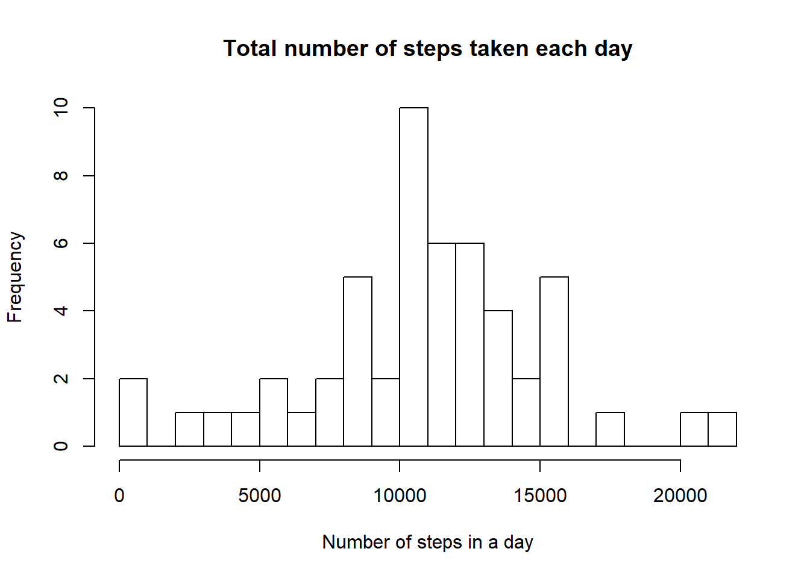
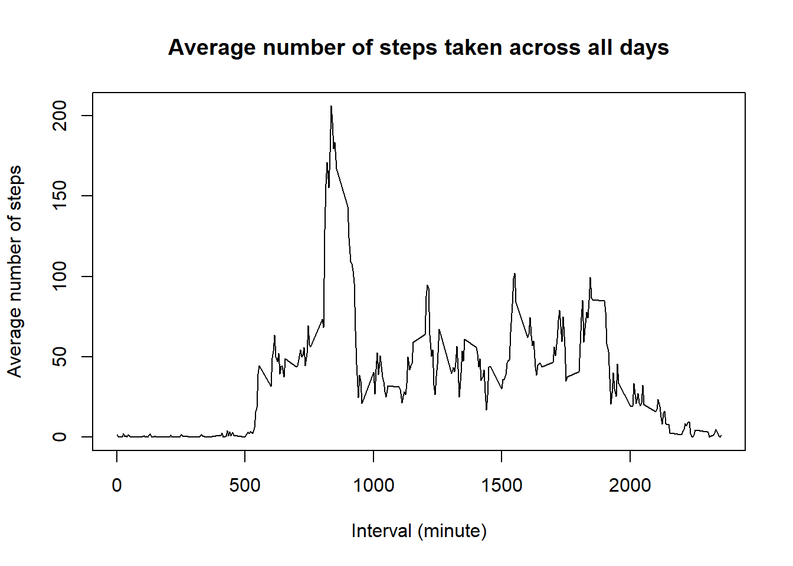
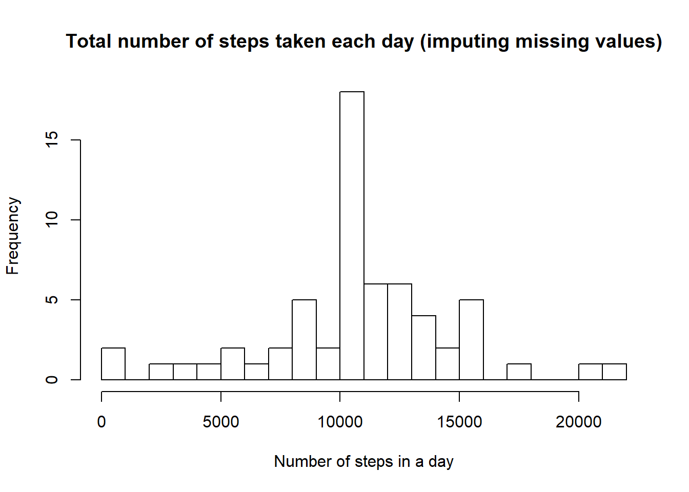
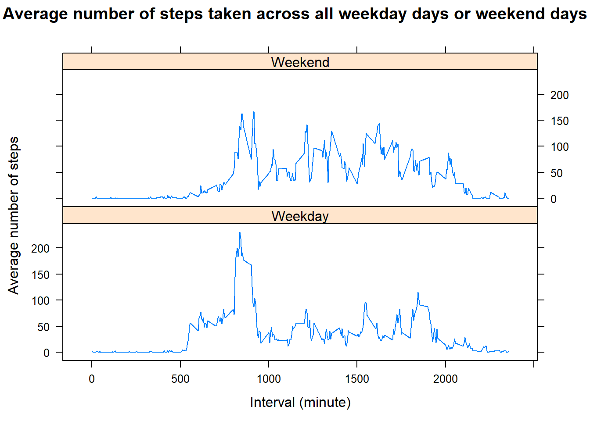

## Loading and preprocessing the data


```r
fileURL <- "https://d396qusza40orc.cloudfront.net/repdata%2Fdata%2Factivity.zip"
fileNAME <- "activity.zip"
if (!file.exists(fileNAME)){
        download.file(url = fileURL, destfile = fileNAME, quiet = TRUE, mode = "w")
        unzip(fileNAME)
}

activity <- read.csv(file = "activity.csv",
                     header = TRUE,
                     sep = ",",
                     na.strings = "NA",
                     colClasses = c("integer", "Date", "integer")
)
str(activity)
```

```
## 'data.frame':	17568 obs. of  3 variables:
##  $ steps   : int  NA NA NA NA NA NA NA NA NA NA ...
##  $ date    : Date, format: "2012-10-01" "2012-10-01" ...
##  $ interval: int  0 5 10 15 20 25 30 35 40 45 ...
```

```r
head(activity, 10)
```

```
##    steps       date interval
## 1     NA 2012-10-01        0
## 2     NA 2012-10-01        5
## 3     NA 2012-10-01       10
## 4     NA 2012-10-01       15
## 5     NA 2012-10-01       20
## 6     NA 2012-10-01       25
## 7     NA 2012-10-01       30
## 8     NA 2012-10-01       35
## 9     NA 2012-10-01       40
## 10    NA 2012-10-01       45
```

```r
summary(activity)
```

```
##      steps             date               interval     
##  Min.   :  0.00   Min.   :2012-10-01   Min.   :   0.0  
##  1st Qu.:  0.00   1st Qu.:2012-10-16   1st Qu.: 588.8  
##  Median :  0.00   Median :2012-10-31   Median :1177.5  
##  Mean   : 37.38   Mean   :2012-10-31   Mean   :1177.5  
##  3rd Qu.: 12.00   3rd Qu.:2012-11-15   3rd Qu.:1766.2  
##  Max.   :806.00   Max.   :2012-11-30   Max.   :2355.0  
##  NA's   :2304
```

## What is mean total number of steps taken per day?

```r
library(dplyr)
steps_by_day <- activity %>% group_by("date" = date) %>% summarise("total" = sum(steps))
hist(steps_by_day$total,
     breaks = 20,
     main = "Total number of steps taken each day",
     xlab = "Number of steps in a day")
```



What is the **mean** of the total number of steps taken per day?


```r
mean(na.omit(steps_by_day$total))
```

```
## [1] 10766.19
```

What is the **median** of the total number of steps taken per day?


```r
median(na.omit(steps_by_day$total))
```

```
## [1] 10765
```

## What is the average daily activity pattern?


```r
library(dplyr)
steps_by_interval <- activity %>% group_by("interval" = interval) %>% summarise("mean.steps" = mean(steps, na.rm = TRUE))
plot(x = steps_by_interval$interval,
     y = steps_by_interval$mean.steps,
     type = "l",
     main = "Average number of steps taken across all days",
     xlab = "Interval (minute)",
     ylab = "Average number of steps")
```



Which 5-minute interval, on average across all the days in the dataset, contains the maximum number of steps?


```r
as.data.frame(steps_by_interval[which(steps_by_interval$mean.steps == max(steps_by_interval$mean.steps)), ])
```

```
##   interval mean.steps
## 1      835   206.1698
```

## Imputing missing values

What is the total number of missing values in the dataset?


```r
colSums(is.na(activity))
```

```
##    steps     date interval 
##     2304        0        0
```

Filling in all of the missing values in the dataset:


```r
activity.i <- activity
for (i in 1:nrow(activity.i)) {
        if (is.na(activity.i$steps[i])) {
                interval.value <- activity.i$interval[i]
                steps.value <- steps_by_interval[steps_by_interval == interval.value, "mean.steps"]
                activity.i$steps[i] <- steps.value$mean.steps
        }
}
```

What is the total number of missing values in the new dataset?


```r
colSums(is.na(activity.i))
```

```
##    steps     date interval 
##        0        0        0
```

Make a histogram of the total number of steps taken each day and calculate and report the mean and median total number of steps taken per day.


```r
library(dplyr)
steps_by_day.i <- activity.i %>% group_by("date" = date) %>% summarise("total" = sum(steps))
hist(steps_by_day.i$total,
     breaks = 20,
     main = "Total number of steps taken each day (imputing missing values)",
     xlab = "Number of steps in a day")
```



What is the **mean** of the total number of steps taken per day?


```r
mean(steps_by_day.i$total)
```

```
## [1] 10766.19
```

What is the **median** of the total number of steps taken per day?


```r
median(steps_by_day.i$total)
```

```
## [1] 10766.19
```

Do these values differ from the estimates from the first part of the assignment? No difference on **mean** and minor one on **median**.  

What is the impact of imputing missing data on the estimates of the total daily number of steps? We can notice an increase of total number of steps taken by day with no major impact on the **mean** and **median**. 


## Are there differences in activity patterns between weekdays and weekends?

Create a new factor variable in the dataset with two levels - "weekday" and "weekend" indicating whether a given date is a weekday or weekend day.  


```r
Sys.setlocale("LC_TIME", "C")
```

```
## [1] "C"
```

```r
activity.i$weekday <- sapply(activity.i$date, function(x) ifelse(weekdays(x) %in% c("Saturday", "Sunday"), "Weekend", "Weekday"))
activity.i$weekday <- as.factor(activity.i$weekday)
```

Make a panel plot containing a time series plot (i.e. type = "l") of the 5-minute interval (x-axis) and the average number of steps taken, averaged across all weekday days or weekend days (y-axis).  


```r
steps_by_interval.i <- activity.i %>% group_by("weekday" = weekday, "interval" = interval) %>% summarise("mean.steps" = mean(steps, na.rm = TRUE))
library(lattice)
xyplot(steps_by_interval.i$mean.steps ~ steps_by_interval.i$interval | steps_by_interval.i$weekday,
       type = "l",
       main = "Average number of steps taken across all weekday days or weekend days",
       xlab = "Interval (minute)",
       ylab = "Average number of steps",
       layout=c(1,2))
```



There is a difference and we can notice more activty over the weekend compare to weekdays.
